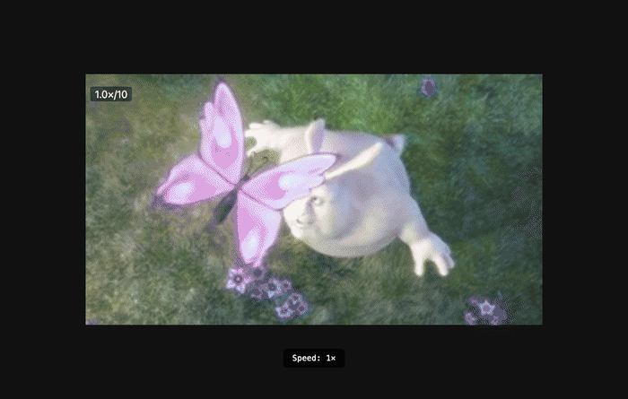
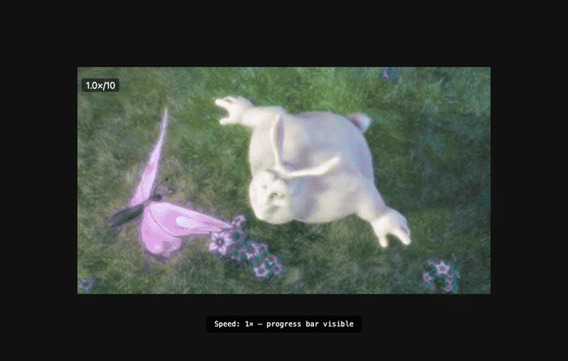
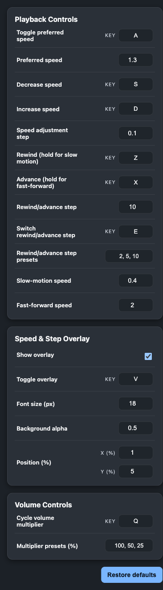

# My Browser Assistant

A Chrome extension that gives you keyboard-driven, fine-grained control over video playback on any site. Speed overlay, hold-to fast-forward/slow-motion, volume cycling — all fully customizable via the side panel.

<p align="center">
  
  <br>
  <em>Speed controls: press <code>d</code> to accelerate, <code>a</code> to toggle preferred speed</em>
</p>

<p align="center">
  
  <br>
  <em>Hold controls: hold <code>Z</code> for slow motion (0.4×), hold <code>X</code> for fast-forward (2×)</em>
</p>

<p align="center">
  
  <br>
  <em>Side panel — customize every key binding, speed value, and overlay style in real time</em>
</p>

## Features

- **Speed controls** — Toggle between 1× and your preferred speed (default `1.3×`), nudge up/down by a configurable step
- **Hold-to fast-forward / slow motion** — Hold the advance key to temporarily jump to a configurable fast-forward rate, or hold the rewind key to drop into slow motion; snap back on release
- **Rewind / advance** — Tap to seek by the active step (default `10s`); cycle through multiple step presets
- **Volume cycling** — Cycle through a list of volume multipliers (allows boosting above 100%)
- **Overlay** — Floating badge showing speed, active step, and volume preset; draggable, toggleable, persists position across fullscreen
- **Side panel** — Real-time settings editor, saved via `chrome.storage.sync` across devices

## Quick Start

1. Open `chrome://extensions`, enable **Developer mode**
2. Click **Load unpacked** and select the `my_browser_assistant` directory
3. Play any video and use the default shortcuts (see below)

No build step required — the extension is plain JavaScript.

## Default Settings

| Key / Setting | Default | Description |
|---|---|---|
| `a` | Preferred speed | Toggle between `1×` and `1.3×` |
| `s` / `d` | Speed step `0.1` | Decrease / increase playback rate |
| `z` | Rewind `10s` | Tap to rewind; hold for slow motion (`0.4×`) |
| `x` | Advance `10s` | Tap to advance; hold for fast-forward (`2×`) |
| `e` | Cycle step presets | Loops: `10s → 2s → 5s → 10s` |
| `q` | Cycle volume | Loops: `100% → 50% → 25% → 100%` |
| `v` | Toggle overlay | Show / hide the speed overlay |
| — | Step presets | `2, 5, 10` seconds |
| — | Volume presets | `100, 50, 25` (percent, can exceed 100) |
| — | Overlay position | `x: 1%, y: 5%` (stored as ratios for fullscreen) |

All keys, speed values, step presets, volume presets, and overlay styling are configurable via the side panel.

## Architecture

```
my_browser_assistant/
├─ manifest.json                        # MV3 manifest
├─ sidepanel/
│  ├─ sidepanel.html / .css / .js       # Settings UI
├─ src/
│  ├─ background/serviceWorker.js       # Side panel lifecycle
│  ├─ content/
│  │  ├─ loader.js                      # Injects main module
│  │  └─ main.js                        # Boots PlaybackOverlayFeature
│  ├─ features/playbackOverlay/         # Controller, overlay, styles
│  └─ lib/
│     ├─ settings.js                    # Storage + defaults
│     ├─ constants.js                   # Shared limits and keys
│     └─ utils.js                       # Shared helpers
```

- **Content script** is injected on every page, watches for `<video>` elements (including shadow DOM players), and attaches a `PlaybackController` to each.
- **Controller** handles rate changes, seeking, volume cycling, and hold-to FF/slow-mo logic.
- **Overlay** displays the current state (`speed / step / volume`) and can be dragged to any position; ratios persist across fullscreen transitions.
- **Side panel** reads from and writes to `chrome.storage.sync`; the content script subscribes to storage changes for real-time sync.

## Notes

- Overlay works on standard `<video>` elements and shadow DOM-based players (`<hls-video>`, etc.).
- Volume presets above 100% boost the audio; state resets to 100% on each page load.
- When the overlay is hidden, speed changes still trigger a brief flash so you always get feedback.